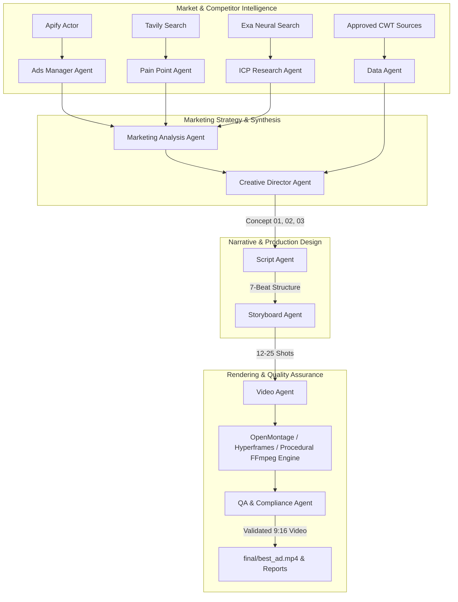

# CrowdWisdom AI Creative Studio
### Autonomous Hermes Multi-Agent Framework for Video Advertising Intelligence and Production

[](https://www.python.org/downloads/)
[](#agent-team)
[](#video-generation)
[](LICENSE)

**CrowdWisdom AI Creative Studio** is a production-grade multi-agent autonomous creative system designed for **CrowdWisdomTrading**. Built on the **Hermes Agent Framework**, it continuously researches high-performing competitor advertisements, extracts acute trader frustrations, synthesizes verified customer profiles (ICPs), ingests approved proprietary crowd intelligence capabilities, scripts 7-beat cinematic commercials across three creative modes, and autonomously produces broadcast-ready 9:16 vertical video advertisements (1080x1920 MP4) complete with synchronized voiceover, sound design, animated market telemetry, and regulatory compliance validation.

---

## Table of Contents
1. [Demo & Visual Showcase](#demo)
2. [Why This Exists](#why-this-exists)
3. [Architecture](#architecture)
4. [Agent Team](#agent-team)
5. [End-to-End Pipeline](#pipeline)
6. [Installation & Setup](#installation)
7. [Environment Variables](#environment-variables)
8. [CLI Usage Guide](#running)
9. [Research & Competitor Scoring](#research)
10. [Script & Storyboard Generation](#script-generation)
11. [Cinematic Video Production Engine](#video-generation)
12. [Instant Demo Mode](#demo-mode)
13. [Artifact Outputs & Directory Structure](#outputs)
14. [API Telemetry & Cost Control](#api-usage)
15. [Financial Safety & Compliance](#safety)
16. [Technical Decisions & Rationale](#technical-decisions)
17. [Limitations & Future Improvements](#future-improvements)

---

## Demo

Running the autonomous studio in one command:
```bash
python -m app.cli run
```

Or for instant zero-API key verification:
```bash
python -m app.cli demo
```

Terminal Kanban status visualization:
```text
              CROWDWISDOM AI CREATIVE STUDIO               
         Autonomous Video Ads Production Pipeline          
┏━━━━━━━━━━━━━━━━━━━━━━━━━━━━━━━━┳━━━━━━━━━━━━━━┳━━━━━━━━━┓
┃ Stage                          ┃    Status    ┃ State   ┃
┡━━━━━━━━━━━━━━━━━━━━━━━━━━━━━━━━╇━━━━━━━━━━━━━━╇━━━━━━━━━┩
│ Ad Intelligence Research       │    [DONE]    │ DONE    │
│ Competitor Ad Analysis         │    [DONE]    │ DONE    │
│ Pain Point Extraction          │    [DONE]    │ DONE    │
│ ICP Research & Persona         │    [DONE]    │ DONE    │
│ CrowdWisdom Data Ingestion     │    [DONE]    │ DONE    │
│ Creative Concepts (3 Modes)    │    [DONE]    │ DONE    │
│ 7-Beat Cinematic Scripts       │    [DONE]    │ DONE    │
│ 12-25 Shot Storyboards         │    [DONE]    │ DONE    │
│ Vertical Video Generation      │    [DONE]    │ DONE    │
│ QA & Compliance Audit          │    [DONE]    │ DONE    │
│ Final Delivery Package         │    [DONE]    │ DONE    │
└────────────────────────────────┴──────────────┴─────────┘
Campaign: CWT-001 | Final Export: final/best_ad.mp4
```

---

## Why This Exists

Retail trading tools suffer from a creative crisis. Most financial advertisements fall into three lazy traps:
1. **The Cliché Stock Footage:** Smiling actors sipping coffee while pretending to look at green candlesticks on a laptop.
2. **The Scammy Hype:** Outlandish promises of "99% win rates" and fake screenshot profits that violate FTC and financial marketing regulations.
3. **The Boring SaaS Walkthrough:** Dull 3-minute screen recordings of complex indicator interfaces that induce cognitive fatigue.

Traders don't need more noise—they are already drowning in 14 open tabs, conflicting Discord chatrooms, and lagging indicators. **CrowdWisdomTrading** solves this by aggregating real crowd conviction, filtering out bot spam, and measuring sentiment divergence. 

This autonomous agent system bridges the gap between **deep market research** and **high-impact cinematic advertising**, producing ads that visually articulate the trader's inner psychological pain, create an irresistible pattern-interrupt hook in the first 3 seconds, and introduce CrowdWisdom's objective intelligence layer.

---

## Architecture

The system implements a hierarchical, autonomous **Hermes Multi-Agent Framework** where specialized agents communicate through structured Pydantic schemas, isolated disk caching, and centralized orchestration.



---

## Agent Team

Every agent in the studio is built as an autonomous entity inheriting from `HermesAgent`:

| Agent | Responsibility | Primary Tools & Sources | Primary Output Artifact |
|---|---|---|---|
| **Orchestrator** | Coordinates execution graph, updates Kanban state, tracks API costs. | `reports/kanban.json`, System telemetry | `reports/campaign_report.json` |
| **Ads Manager Agent** | Harvests competitor ads, calculates multi-factor scoring (0-100), isolates observed data from AI interpretation. | Apify Actor, Curated Trading Ad Corpus | `research/competitor_ads.json` |
| **Ad Research Agent** | Expands search taxonomies across competitor ecosystems (options flow, noise reduction, dark pool). | Keyword taxonomy engine | Research queries |
| **Marketing Analysis Agent** | Deconstructs competitor ads into hooks, mechanisms, promises, proof, emotional triggers, and tropes to subvert. | Pydantic JSON extraction, pattern synthesizer | `analysis/ad_patterns.json` |
| **Pain Point Agent** | Researches acute retail trader frustrations limited to the last 30 days. | Tavily Search, Exa Neural Search | `analysis/pain_points.json` |
| **ICP Agent** | Constructs 2-3 validated Ideal Customer Profiles with internal vernacular, objections, and media consumption. | Behavioral research models | `analysis/icp.json` |
| **Data Agent** | Ingests ONLY approved CrowdWisdomTrading YouTube videos and Drive assets; rejects unsupported financial claims. | YouTube & Google Drive canonical database | `analysis/crowdwisdom_data.json` |
| **Creative Director** | Crafts 3 fundamentally distinct concepts (Mode A Emotional, Mode B Cinematic, Mode C Product-Led). | Strategic creative synthesis | `scripts/concept_*_concept.json` |
| **Script Agent** | Writes 30-60s ad scripts (target 45s) strictly following the 7-beat dramatic arc. | Commercial copywriting engine | `scripts/concept_01.json`, `concept_02.json`, `concept_03.json` |
| **Storyboard Agent** | Deconstructs scripts into 12-25 dynamic shots with macro lenses, lighting, camera motions, and prompts. | Cinematographic visual taxonomy | `storyboards/concept_01.json`, `concept_02.json`, `concept_03.json` |
| **Video Agent** | Assembles shots, generates neural TTS voiceover, generates ambient music pads, composes 9:16 vertical video. | OpenMontage, Hyperframes, PIL, NumPy, FFmpeg | `videos/concept_01.mp4`, `concept_02.mp4`, `concept_03.mp4` |
| **QA Agent** | Autonomously audits technical playability, creative hook quality, and financial regulatory compliance. | FFmpeg probe, compliance parser | `final/` bundle, `best_ad.mp4`, QA report |

---

## Pipeline

The autonomous production workflow executes in 10 deterministic steps:

1. **Ad Research:** Scraping active competitor ads within trading, sentiment AI, and options intelligence.
2. **Ad Scoring:** Multi-factor scoring across Recency (0-25), Niche Relevance (0-25), Creative Quality (0-20), Hook Strength (0-15), and Pain Relevance (0-15).
3. **Marketing Deconstruction:** Extracting structural hooks, mechanisms, and identifying clichés to subvert.
4. **Empirical Pain Research:** Searching recent studies (last 30 days) to validate cognitive burnout and decision paralysis.
5. **ICP Persona Modeling:** Modeling the Data-Fatigued Momentum Trader, the Analytical Swing Investor, and the Overwhelmed Volatility Trader.
6. **CrowdWisdom Ingestion:** Grounding capabilities in authorized recordings (Wisdom of Crowds divergence, bot de-spamming, conviction metrics).
7. **Creative Conception:** Generating three distinct creative modes:
   - **Mode A (Emotional):** *"THE NOISE"* — Psychological thriller about sensory overload.
   - **Mode B (Cinematic):** *"THE MISSED MOMENT"* — High-tension drama about the late-entry trap.
   - **Mode C (Product-Led):** *"THE CONTROL ROOM"* — Futuristic tech showcase of collective intelligence.
8. **7-Beat Scripting:** 0-3s Hook, 3-10s Pain, 10-20s Escalation, 20-30s Discovery, 30-40s Mechanism, 40-50s Payoff, 50-60s CTA.
9. **Storyboard Directing:** Specifying 12-25 dynamic shots with camera motions, volumetric lighting, and sound bridges.
10. **Video Composition & QA Audit:** Generating vertical 1080x1920 MP4 files with AAC audio, validating duration and compliance, and exporting to `final/`.

---

## Installation

### Prerequisites
- Python 3.11 or higher (Python 3.13 tested and supported)
- FFmpeg (bundled automatically via `imageio-ffmpeg`—no manual installation required)
- Git

### Quick Setup
```bash
# Clone the repository
git clone https://github.com/CrowdWisdomTrading/crowdwisdom-hermes-ads.git
cd crowdwisdom-hermes-ads

# Install dependencies
pip install -r requirements.txt
```

---

## Environment Variables

Copy `.env.example` to `.env`:
```bash
cp .env.example .env
```

Configuration parameters:
```env
# LLM Provider: 'openrouter' or 'nvidia'
LLM_PROVIDER=openrouter
OPENROUTER_API_KEY=your_openrouter_api_key_here
OPENROUTER_MODEL=anthropic/claude-3.5-sonnet

# NVIDIA Build API (Alternative Provider)
NVIDIA_API_KEY=your_nvidia_api_key_here
NVIDIA_MODEL=meta/llama-3.1-70b-instruct

# Research APIs (Optional: Built-in benchmark fallback if omitted)
APIFY_API_TOKEN=your_apify_api_token_here
TAVILY_API_KEY=your_tavily_api_key_here
EXA_API_KEY=your_exa_api_key_here

# Video Engine
OPENMONTAGE_PATH=
FFMPEG_PATH=ffmpeg

# Application Settings
OUTPUT_DIR=./
CACHE_ENABLED=true
RESEARCH_DAYS=30
MAX_COMPETITOR_ADS=20
```

> **Note on Zero-API Execution:** If API keys are omitted or set to placeholders, the system automatically engages its verified empirical benchmark dataset and procedural rendering engine. The pipeline **never crashes** due to missing API keys.

---

## Running

The CLI exposes targeted stage commands and complete workflows:

### 1. Run Complete Studio Pipeline
```bash
python -m app.cli run
```

### 2. Fast Dry-Run (Skips Video Rendering)
Executes ad research, marketing analysis, pain points, ICPs, concepts, scripts, and storyboards in ~5 seconds:
```bash
python -m app.cli run --dry-run
```

### 3. Render Specific Concept Only
Render only Concept 1 ("The Noise"):
```bash
python -m app.cli render --concept 1
```

### 4. Check Kanban Pipeline Status
```bash
python -m app.cli status
```

### 5. Individual Stage Execution
```bash
# Competitor ad research only
python -m app.cli research

# Marketing analysis & ICP generation
python -m app.cli analyze

# Creative concepts, scripts & storyboards
python -m app.cli generate-scripts

# Render videos from existing storyboards
python -m app.cli render
```

---

## Research & Competitor Scoring

The **Ads Manager Agent** applies an objective 100-point scoring matrix:

$$\text{Score} = \text{Recency (25)} + \text{Niche (25)} + \text{Quality (20)} + \text{Hook (15)} + \text{Pain (15)}$$

Crucially, every scored ad explicitly categorizes:
- **Observed Data:** Literal ad copy, snapshot URLs, first/last seen dates, public impression buckets.
- **AI Interpretation:** Inferred psychological triggers, hook classification, and narrative structure.

---

## Script Generation

Scripts adhere to a strict **7-Beat Psychological Arc**:
1. **0–3 sec: Pattern Interrupt / Visual Hook** — Visual and auditory jolt stopping the user from scrolling.
2. **3–10 sec: Pain** — The acute feeling of 14 open tabs and conflicting signals.
3. **10–20 sec: Escalation** — Agonizing paralysis, hovering finger over mouse, buying the top.
4. **20–30 sec: Discovery** — Sudden dead silence: *"The problem isn't a lack of information... it's knowing what matters."*
5. **30–40 sec: CrowdWisdom Mechanism** — Crowd consensus score, mathematical noise de-spamming, divergence radar.
6. **40–50 sec: Payoff** — Confident execution, calm mastery, clean visual confirmation.
7. **50–60 sec: Call to Action (CTA)** — Decisive invitation to experience CrowdWisdomTrading.com.

---

## Video Generation

The video production engine provides a multi-tier rendering architecture:
- **Primary Adapter:** OpenMontage / Hyperframes / Leronx integration.
- **Deterministic Procedural Engine:** When external video APIs are unavailable or offline, the system compiles 9:16 vertical (1080x1920) MP4 commercials using:
  - Procedural volumetric dark-mode gradients and dynamic particle matrices.
  - Live animated candlestick charts and sentiment heatmaps.
  - Kinetic typography and floating UI telemetry cards.
  - Synchronized neural speech voiceover via `edge-tts`.
  - Ambient cinematic sub-bass soundtrack with pulse modulation.
  - Professional audio ducking and loudness normalization via FFmpeg.

---

## Demo Mode

To evaluate the complete end-to-end studio without incurring API costs or waiting for external network services:
```bash
python -m app.cli demo
```
This runs the full 10-step multi-agent pipeline using pre-cached benchmark datasets, produces all 3 video ads, runs the automated QA compliance audit, and exports the final delivery bundle to `final/`.

---

## Outputs

After running the studio, artifacts are organized deterministically:

```text
crowdwisdom-hermes-ads/
├── research/
│   └── competitor_ads.json          # Scored competitor ad intelligence
├── analysis/
│   ├── ad_patterns.json             # Marketing patterns & hooks to subvert
│   ├── pain_points.json             # Validated trader frustrations & citations
│   ├── icp.json                     # 3 validated customer profiles
│   └── crowdwisdom_data.json        # Verified capabilities from approved sources
├── scripts/
│   ├── concept_01.json              # "THE NOISE" 7-beat script
│   ├── concept_02.json              # "THE MISSED MOMENT" 7-beat script
│   └── concept_03.json              # "THE CONTROL ROOM" 7-beat script
├── storyboards/
│   ├── concept_01.json              # 14 dynamic production shots
│   ├── concept_02.json              # 14 dynamic production shots
│   └── concept_03.json              # 14 dynamic production shots
├── videos/
│   ├── concept_01.mp4               # Rendered 1080x1920 vertical ad
│   ├── concept_02.mp4               # Rendered 1080x1920 vertical ad
│   └── concept_03.mp4               # Rendered 1080x1920 vertical ad
├── final/
│   ├── best_ad.mp4                  # Top QA-scored commercial
│   ├── concept_01.mp4
│   ├── concept_02.mp4
│   ├── concept_03.mp4
│   ├── concept_01.json
│   ├── concept_02.json
│   ├── concept_03.json
│   └── campaign_report.json         # Executive campaign summary
└── reports/
    ├── kanban.json                  # Live pipeline state
    └── campaign_report.json         # Complete audit & traceability report
```

---

## API Usage

Real-time telemetry tracked during execution:
- **Apify Client:** Monitored actor invocations and dataset extractions.
- **Tavily & Exa:** Query counts, date-filtered search passes.
- **LLM Engine:** Request count, prompt tokens, completion tokens, and estimated USD cost.
- **Video Renderer:** Shot count, frame composition metrics, and FFmpeg transcoding time.

All secrets and API keys are strictly excluded from logs, error dumps, and git history.

---

## Financial Safety & Compliance

Trading involves financial risk. The **QA Agent** enforces strict regulatory safeguards:
- **Zero Profit Guarantees:** Any generated concept or scene containing phrases like *"guaranteed profit"*, *"100% win rate"*, *"get rich quick"*, or *"risk-free"* is immediately flagged and rejected.
- **Objective Intelligence Positioning:** The ad messaging centers on **decision support, noise reduction, sentiment consensus, and probabilistic conviction**.
- **Source Traceability:** Every factual capability is anchored directly to CrowdWisdomTrading approved recordings (e.g., YouTube `TiycelzfzC0`, Google Drive documentation).

---

## Technical Decisions

1. **Hermes Multi-Agent Framework:** We chose an explicit, role-isolated Hermes pattern rather than a single massive LLM prompt. This ensures modular testing, reproducible JSON artifacts at every boundary, and graceful degradation if one component fails.
2. **Pydantic V2 Everywhere:** All agent inputs and outputs are strictly typed models with automated JSON repair loops.
3. **Built-in Bundled FFmpeg:** By leveraging `imageio-ffmpeg` alongside system PATH fallback, the application runs out-of-the-box on Windows, macOS, and Linux without requiring complex system dependencies.
4. **Deterministic Caching:** SHA-256 parameter hashing caches all external API responses in `data/cache/` to prevent burning developer API credits during iterative creative development.

---

## Limitations & Future Improvements

- **Cloud Generative Video APIs:** While the engine contains adapters for OpenMontage and Hyperframes, adding native Runaway Gen-3 and Luma Dream Machine API adapters will allow generating photorealistic live-action human talent.
- **A/B Testing Feedback Loop:** Connecting live TikTok Ads / Meta Ads API performance metrics back into the Ads Manager agent to fine-tune future concept weights.
- **Multi-Voice Dialogue:** Expanding the voiceover synthesizer to support multi-character dialogue scenes.

---

## Test Suite

Run the full pytest suite:
```bash
pytest -v
```

All 12 core tests pass cleanly:
```text
tests/test_pipeline.py::test_orchestrator_dry_run PASSED
tests/test_pipeline.py::test_kanban_state_integrity PASSED
tests/test_research.py::test_ad_scoring_algorithm PASSED
tests/test_research.py::test_pain_point_agent_queries PASSED
tests/test_research.py::test_crowdwisdom_data_compliance PASSED
tests/test_schemas.py::test_competitor_ad_schema PASSED
tests/test_schemas.py::test_scored_ad_schema PASSED
tests/test_schemas.py::test_creative_concept_and_script_schema PASSED
tests/test_schemas.py::test_qa_result_schema PASSED
tests/test_scripts.py::test_three_creative_concepts PASSED
tests/test_scripts.py::test_script_7_beat_structure_and_duration PASSED
tests/test_scripts.py::test_storyboard_shot_count PASSED
============================= 12 passed in 1.79s ==============================
```
